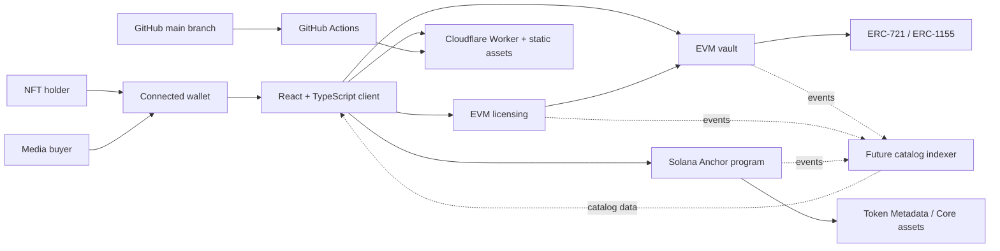

# Lucky Commons architecture

## System objective

Lucky Commons connects two user journeys without conflating their permissions:

- NFT holders can create chain-local pool positions.
- Media buyers can purchase usage rights only from reviewed, licensable
  positions or explicitly public-domain packages.

The design keeps NFTs on their origin chain. Events from each deployment can be
indexed into one catalog, but custody and settlement remain chain-local.

## System map



The catalog indexer in the diagram is a required production component, not an
implemented service in this repository. The preview currently uses a static
catalog model.

## Components

### Web client

`src/App.tsx` renders the holder and buyer experiences. Supporting modules:

- `src/lib/evm.ts`: EVM networks, Wagmi configuration, and minimal ABIs.
- `src/lib/solana.ts`: Solana purchase-plan construction and simulation.
- `src/lib/catalog.ts`: preview catalog data.
- `src/lib/terms.ts`: pool terms URI and hash.
- `src/lib/licenseTerms.ts`: licensing terms URI and hash.
- `src/lib/product.ts`: product-state and availability helpers.

The browser contains no deployer or custody key. Users sign through connected
wallets.

### Cloudflare Worker

`worker/index.ts` serves the Vite output through the `ASSETS` binding, adds
security headers, exposes `/api/health`, and returns JSON 404 responses for
unknown API routes. It stores no application database and performs no payment
processing.

`wrangler.jsonc` is the source of truth for Worker name, compatibility date,
entry point, and static-asset behavior.

### EVM token

`contracts/LuckyCommonsToken.sol` is an ERC-20 with burn and permit support. Its
constructor mints a fixed one-billion-token supply to the treasury argument.
It is not currently wired into vault accounting or a cross-chain bridge.

### EVM vault

`contracts/LuckyCommonsVault.sol`:

- Custodies ERC-721 and ERC-1155 assets.
- Rejects unsolicited safe transfers.
- Records depositor, asset, amount, standard, time, terms, and rights
  attestation for every position.
- Enforces the withdrawal cooldown and active license lock.
- Receives native-asset revenue.
- Allows the owner to allocate revenue to an explicit recipient and purpose.
- Supports pausing and two-step ownership transfer.

One vault is deployed per EVM chain. Position IDs are local to that vault and
must always be namespaced by chain ID and vault address offchain.

### EVM licensing

`contracts/LuckyCommonsLicensing.sol`:

- Stores immutable package definitions plus an operator-controlled active flag.
- Supports public-domain packages and depositor-attested packages.
- Requires every deposited position in a licensable package to remain active
  and commercially attested.
- Accepts exact native-asset payment.
- Locks package positions through the vault for the license duration.
- Routes payment atomically into the vault.
- Mints a non-transferable ERC-721 receipt to the beneficiary.

Package IDs and receipt IDs are local to a licensing deployment and must be
namespaced by chain ID and contract address offchain.

### Solana program

`programs/luckycommons-solana/src/lib.rs` implements analogous state with Program
Derived Addresses:

- Global config and vault authority PDAs.
- Position PDAs derived from the asset.
- Package and receipt PDAs.
- Token Metadata and Metaplex Core deposit/withdraw paths.
- Native SOL package settlement and revenue allocation.
- Terms versions, rights attestations, cooldowns, and license locks.

The program validates canonical metadata and program ownership before treating
accounts as supported assets. The browser prepares and simulates purchase
instructions before requesting a wallet signature.

## Primary data flows

### EVM NFT deposit

```text
approve vault -> accept current terms -> depositERC721/depositERC1155
-> vault verifies expected transfer -> NFT enters custody
-> PositionOpened event -> chain-local position
```

Direct safe transfers are rejected because they would bypass position
accounting.

### EVM license purchase

```text
select reviewed package -> verify price/terms/beneficiary
-> purchaseNative with exact payment
-> validate every position -> lock positions until validUntil
-> deposit native revenue in vault -> mint non-transferable receipt
```

Payment, position locking, and receipt issuance are one transaction.

### Solana license purchase

```text
derive config/package/receipt PDAs -> construct purchase instruction
-> prepare transaction -> simulate -> display cluster/accounts/amount/fee payer
-> wallet signs -> SOL enters program vault -> receipt PDA records purchase
```

### Web release

```text
merge to main -> GitHub Actions verification -> Vite build
-> Wrangler deploy -> Cloudflare version -> live health check
```

## Trust boundaries

| Boundary | Trusted input | Untrusted input | Required control |
| --- | --- | --- | --- |
| Browser ↔ wallet | User-confirmed chain and transaction | Page state and catalog metadata | Display decoded target, amount, and beneficiary |
| Browser ↔ RPC | Configured chain identity | RPC responses and account data | Validate chain, owner, address, discriminator, and length |
| Operator ↔ rights evidence | Signed or authoritative rights source | NFT metadata and marketplace claims | Independent review and retained evidence |
| Licensing ↔ vault | Approved licensing contract | Arbitrary callers | Vault operator allowlist |
| GitHub ↔ Cloudflare | Reviewed `main` commit | Pull-request code | Required checks and scoped deployment token |
| Owner ↔ revenue | Approved allocation policy | Arbitrary recipient request | Multisig review and purpose record |

## Chain model

NFTs and license payments are intentionally chain-local:

| Network | Custody | Payment | Receipt |
| --- | --- | --- | --- |
| Ethereum-compatible chain | Chain-local vault | Native ETH or POL | Non-transferable ERC-721 |
| Solana cluster | Program-controlled asset custody | SOL | Receipt PDA |

The protocol does not bridge NFTs. A future indexer may provide a unified view
without taking custody.

## Repository map

```text
.github/workflows/       CI/CD
contracts/               Solidity token, vault, and licensing contracts
contracts/test/          Solidity test assets
docs/                    GitHub Pages showcase and operator documentation
programs/                Solana Anchor program
scripts/                 Deployment and build helpers
src/                     React client and chain adapters
test/                    EVM contract tests
worker/                  Cloudflare Worker entry point
wrangler.jsonc           Cloudflare deployment source of truth
```

## Known gaps

- No production deployment registry.
- No trustless prize-selection mechanism.
- No funded prize or claims implementation.
- No production rights-review backend.
- No chain event indexer or dynamic catalog.
- No operator CLI for package creation or Solana initialization.
- No unified multichain `$LUCK` supply.
- No monitoring or alert integration beyond the health route.
- No completed independent security or legal review.

These gaps are product constraints, not hidden roadmap items. Public messaging
must continue to label the site as a preview until they are closed.
